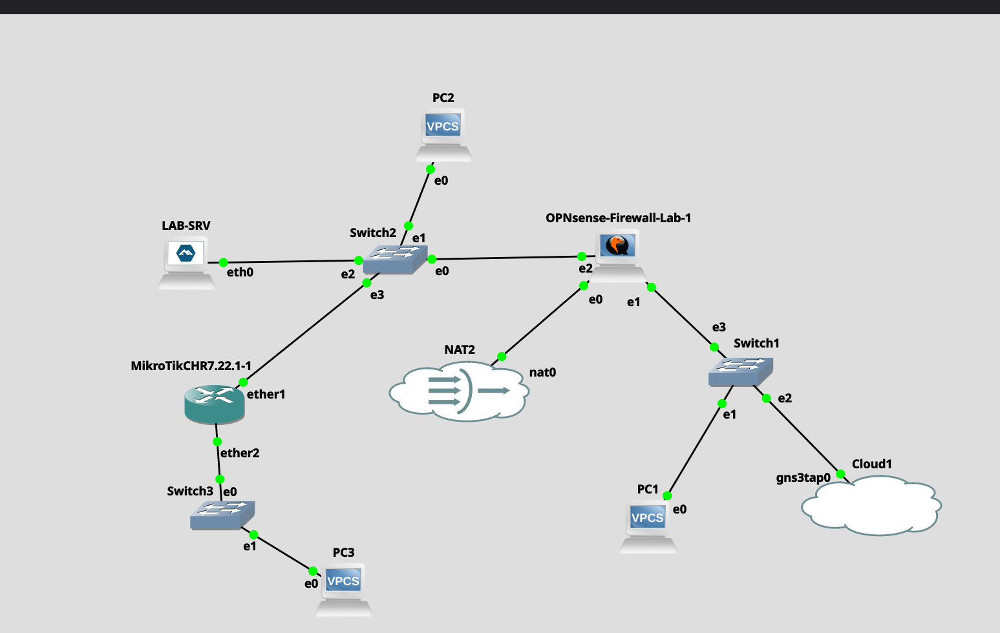
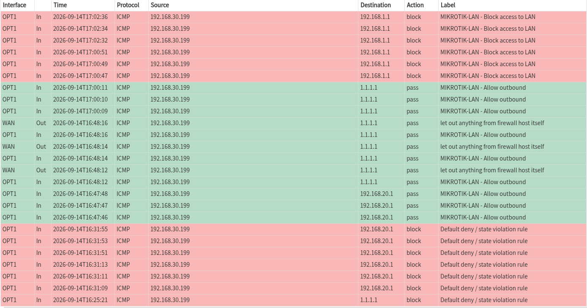
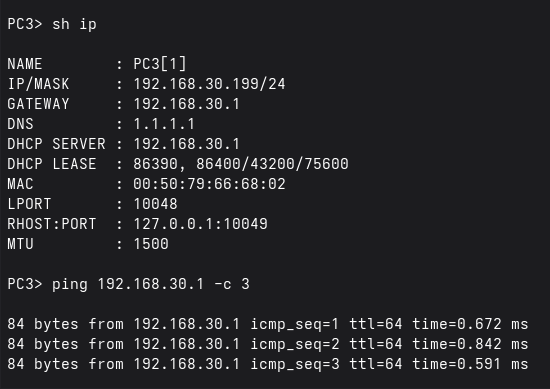
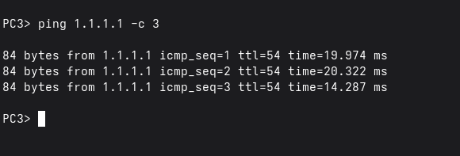
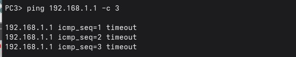
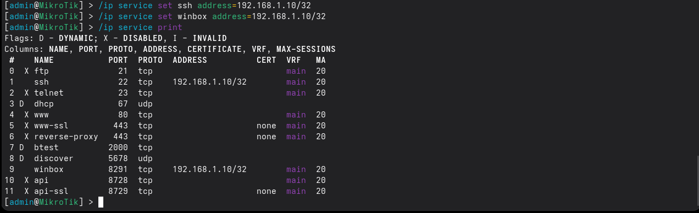
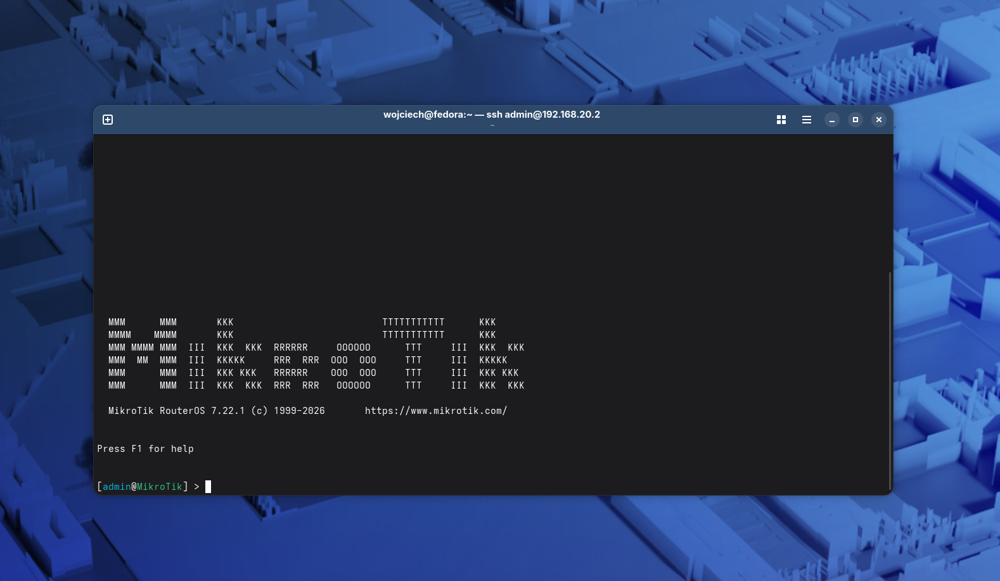

# OPNsense & MikroTik Network Segmentation Lab

A practical network-security lab built in **GNS3**, combining **OPNsense** as the perimeter firewall with **MikroTik RouterOS CHR** as an internal router.

The project demonstrates network segmentation, routing, firewall policy enforcement, NAT, DHCP, service hardening and controlled administrative access.

## Key Results

| Validation | Result |
|---|---|
| PC3 → MikroTik gateway | ✅ PASS |
| PC3 → Internet | ✅ PASS |
| PC3 → Trusted LAN | 🔒 BLOCKED as designed |
| Fedora → MikroTik SSH | ✅ PASS |
| OPNsense firewall logging | ✅ VERIFIED |
| Post-hardening connectivity | ✅ PASS |

The main security objective was achieved:

> **The downstream MikroTik network can access the Internet while remaining isolated from the trusted management LAN.**

## Architecture



### Network Segments

| Segment | Network | Gateway / Device | Purpose |
|---|---|---|---|
| WAN | `192.168.122.0/24` | OPNsense WAN | GNS3 NAT / Internet uplink |
| Trusted LAN | `192.168.1.0/24` | OPNsense `192.168.1.1` | Management network |
| LAB / Transit | `192.168.20.0/24` | OPNsense `192.168.20.1` | Lab and transit network |
| MikroTik LAN | `192.168.30.0/24` | MikroTik `192.168.30.1` | Routed downstream client network |

MikroTik CHR uses:

- `ether1` — `192.168.20.2/24`
- `ether2` — `192.168.30.1/24`
- default gateway — `192.168.20.1`

OPNsense contains a return route:

`192.168.30.0/24 → 192.168.20.2`

Detailed design: [Network Architecture](docs/ARCHITECTURE.md)

## Security Controls

The lab implements:

- stateful firewall policy enforcement on OPNsense
- explicit isolation of MikroTik LAN from the trusted LAN
- controlled Internet access for the downstream network
- firewall logging for validation and troubleshooting
- manual WAN source NAT for the routed MikroTik network
- MikroTik default-deny INPUT policy
- invalid connection-state filtering
- established/related connection handling
- unnecessary RouterOS services disabled
- SSH and WinBox restricted to the Fedora management host `192.168.1.10/32`

## Validation Evidence

### 1. OPNsense firewall policy enforcement

The firewall logs demonstrate both permitted Internet traffic and blocked attempts from the MikroTik LAN to the trusted LAN.



### 2. MikroTik DHCP and gateway

PC3 receives its network configuration from MikroTik and successfully reaches its default gateway.



### 3. Internet connectivity

PC3 successfully reaches `1.1.1.1` through:

`PC3 → MikroTik → OPNsense → WAN`



### 4. Trusted LAN isolation

Traffic from PC3 to the trusted OPNsense LAN interface (`192.168.1.1`) is blocked as designed.



### 5. RouterOS service hardening

Unnecessary management services were disabled. SSH and WinBox remain available only from the designated Fedora management host.



### 6. Controlled SSH management

SSH access from the Fedora management workstation remains operational after hardening.



Full test results: [Validation Report](docs/VALIDATION.md)

## Repository Structure

```text
.
├── configs/
│   └── mikrotik/
│       └── mikrotik-chr-final.rsc
├── docs/
│   ├── ARCHITECTURE.md
│   └── VALIDATION.md
├── evidence/
│   ├── mikrotik/
│   ├── opnsense/
│   └── topology/
├── .gitignore
└── README.md
```

## Technologies

**GNS3 · OPNsense · MikroTik RouterOS CHR · Linux/Fedora · VPCS · TCP/IP · DHCP · NAT · Stateful Firewalling · Network Segmentation · SSH**

## Project Status

**Completed and validated.**

The final environment demonstrates a working multi-segment network in which routing and Internet access remain operational while security boundaries are enforced and administrative exposure is reduced through RouterOS hardening.
